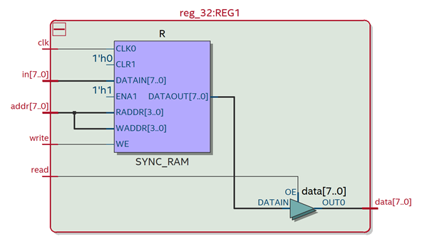
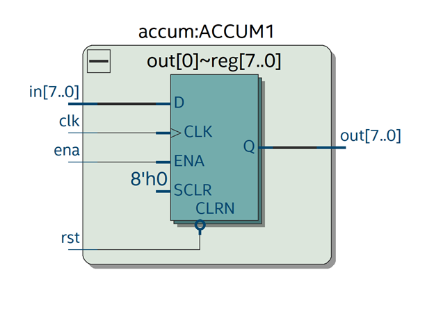
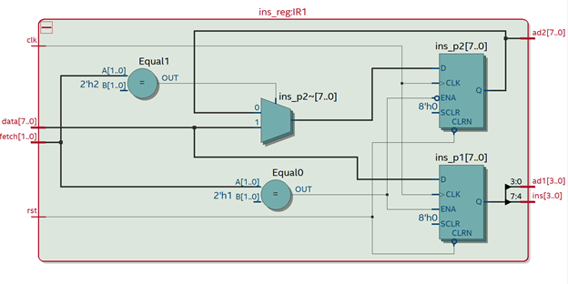
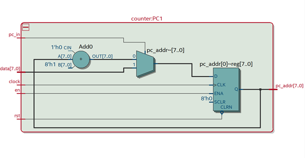
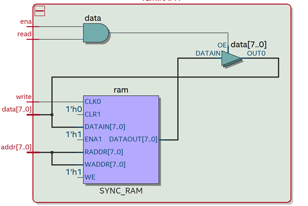
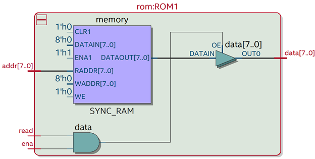
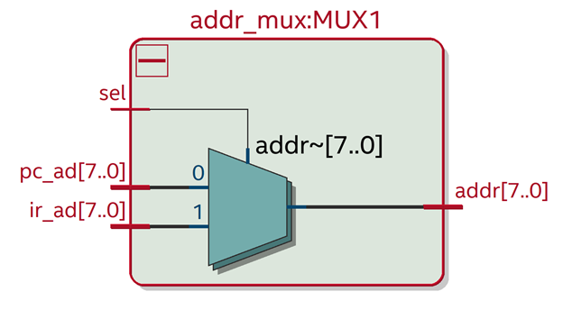

# 8 Bit RISC CPU
## Arsitektur
CPU ini memiliki arsitektur yang berdasarkan dari arsitektur Von-Neumman dimana, Control Unit, ALU dan Register berada didalam satu bagian yang disebut dengan CPU, kemudian memory unit terdapat terpisah. Gambar dari Von Neumman Architecture dapat dilihat dibawah ini

## Macro Architecture
CPU ini memiliki Macro Architecture sebagai Berikut

## Micro Architecture
CPU ini terdiri dari 10 Bagian yaitu

### Control Unit
Control Unit berfungsi sebagai otak dari CPU, pada CPU ini control unit berfungsi untuk memberikan signal kepada blok-blok lainnya yang berada pada CPU.

### ALU 
ALU berfungsi sebagai otak proses penghitungan dari CPU, pada CPU ini, fungsi matematika yang didukung adalah penambahan serta pengurangan (hanya dapat mengurangi dengan satu). CPU ini juga memiliki register Temporary yang digunakan untuk menyimpan integer.

### Register
Pada CPU ini, Register yang ada berjumlah 16, dimana tiap register dapat menampung sebanyak 8 bit. Sehingga jumlah dari Register adalah sebanyak 16 Byte.

### Accumulator
Accumulator bekerja sebagai tempat penyimpanan sementara dari hasil proses perhitungan dari ALU. Accumulator yang ada mendapat data dari ALU dan data yang dikeluarkan kemudian juga akan dipakai kembali oleh ALU.

### Instruction Register
Instruction Register mempunyai fungsi untuk menentukan instruksi apa yang akan dijalankan oleh blok-blok yang lainnya. Instruction register mendapat instruksi dari hasil fetch ROM. Selain itu Instruction Register juga berfungsi untuk membedakan address yang diberikan adalah address dari Instruksi atau address untuk Register.

### Program Counter
Program Counter berfungsi sebagai detak jantung dari CPU, dimana program counter sendiri digunakan untuk memberikan alamat dari memory untuk dieksekusi. PC pada CPU kami berfungsi untuk memberikan alamat yang berupa alamat ROM. PC pada CPU ini juga dapat menerima input sebanyak 8 Bit yang berupa address dari ROM.

### RAM
RAM merupakan memory sementara yang digunakan untuk menyimpan data hasil perhitungan ataupun data yang didapatkan dari Register. RAM yang terdapat di CPU adalah sebanyak 256 Bytes atau 256 * 8 Bit.

### ROM
ROM merupakan memory yang digunakan untuk menyimpan instruksi/program yang akan dijalankan oleh CPU. ROM yang terdapat di CPU ini adalah sebanyak 256 Bytes atau 256 * 8 Bit.

### Address Multiplexer
Address Multiplexer digunakan untuk memilih apakah address yang akan diakses adalah address yang diberikan dari PC atau address yang didapatkan dari instruksi. 

## Instruksi
CPU ini mendukung sampai dengan 16 Instruksi, namun dalam implementasi ini, instruksi yang dipakai adalah sebanyak 12 Instruksi yaitu

Instruksi |Binary|Operation|Deskripsi|Tipe
---|---|---|---|---
NOP|0000|**No** O**p**eration|Tidak ada instruksi yang dilakukan|Short
LDO|0001|**L**oa**d** from R**O**M|Mengambil data dari ROM|Long
LDA|0010|**L**oa**d** from R**A**M| Mengambil data dari RAM|Long
STO|0011|**Sto**re register data to RAM|menambil data dari register ke ram|Long
PRE|0100|**Pre**fetch data from REG|Mengambil data dari REG dan memasukan ke ACCUM|Short
ADD|0101|**Add** data from register with ACCUM| Mengambil data dari register dan menambahkannya dengan accumulator|Short
LDM|0110|**L**oa**d** Multiple|Mengambil data dari ACCUM ke Register|Short
ADN|0111|**Add** integer to ACCUM|Menambah integer kedalam ACCUM|Short
INC|1000|**Inc**rease ACCUM count|Menambah hasil dari ACCUM dengan integer satu |Short
DEC|1001|**Dec**rease ACCUM count|Mengurangi hasil dari ACCUM dengan integer satu|Short
JMP|1010|**J**u**mp** to Address|Mengambil address dari ROM dan melompat ke instruksi dengan address tersebut|Long
CLR|1011|**Cl**ea**r** ACCUM|Melakukan Pengosongan pada ACCUM|Short
SUB|1100|**Sub**tract register data from ACCUM |Melakukan pengurangan sejumlah data Register pada ACCUM|Short
HLT|1111|**H**a**lt** the operation|Memberhentikan Operasi|short